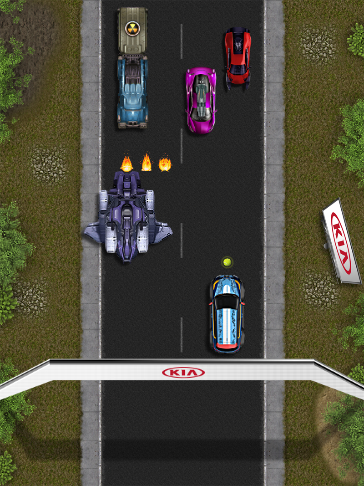
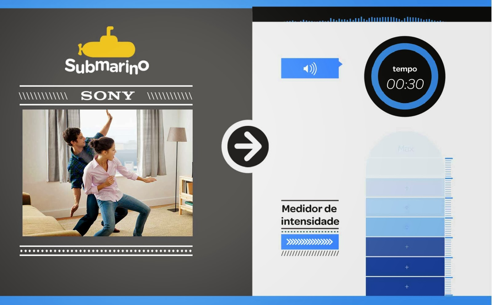
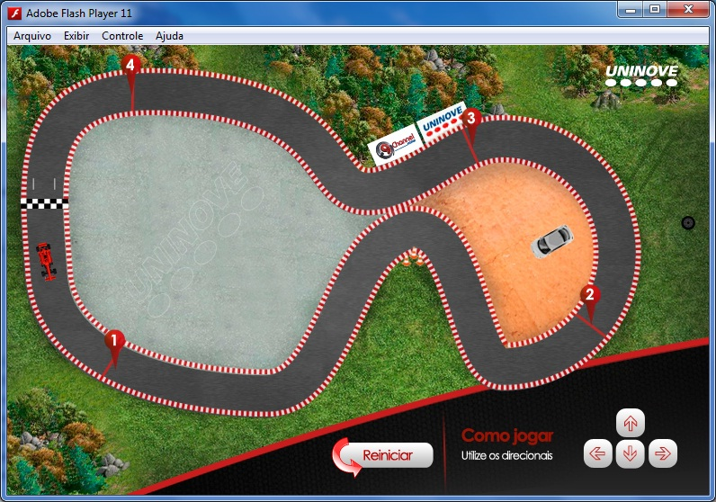
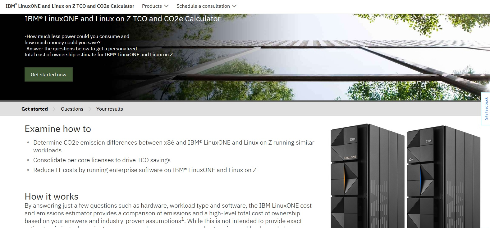
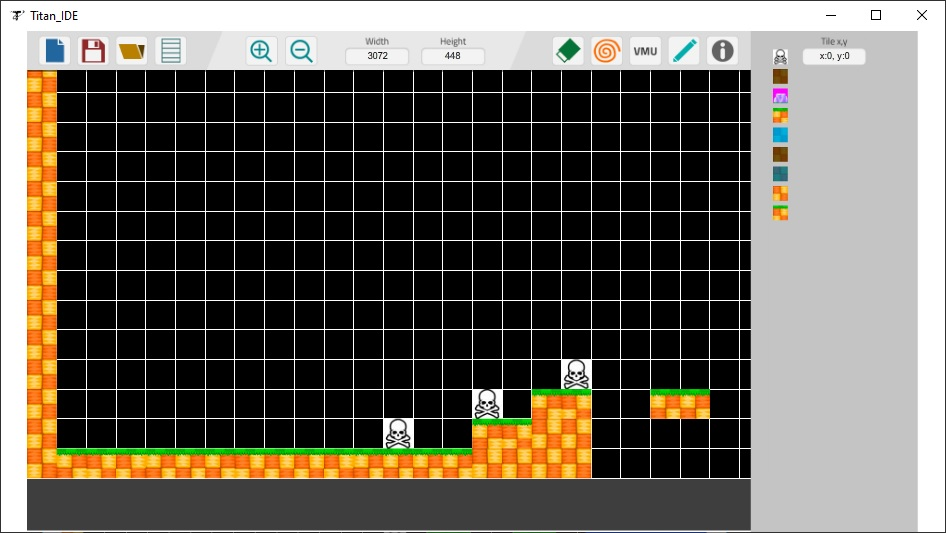
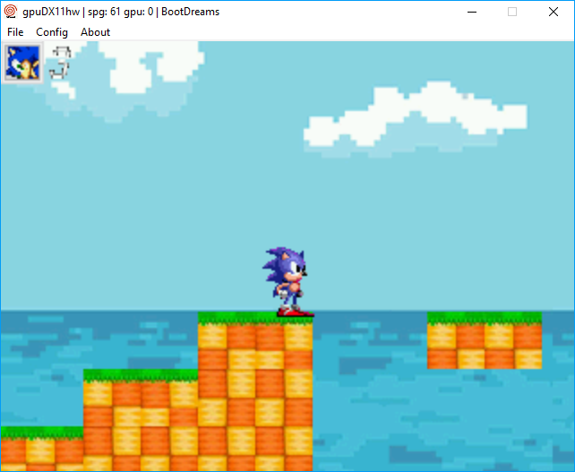

## Welcome to my GitHub Page.

Hi there, I'm Luiz Fernando Nai Ribeiro, I've been working on the industry since 2011, with technologies like Flash, (HTML, CSS, JavaScript), Jquery, Contruct 2, React.JS, Vue, Angular, Protheus (TLPP), Scala, Python, SQL and others.

In my free time I like to develop homebrews for retro consoles with languages as C and C++ under the name [Titan Game Studios](https://titangamestudioscom.wordpress.com/) and I also have an Youtube Channel [Nai Adventure](https://www.youtube.com/@NaiAdventure). Feel free to take a look at my repositories and get in touch with me if you have any questions.

### Some of my Projects:

  <figure>
    
    <figcaption>Game developed for the event Australia Open with Construct 2.</figcaption>
  </figure>  
   
  <figure>
    
    <figcaption>Game to be played with the Microsoft Kinect developed for the company Submarino.</figcaption>
  </figure>
   
  <figure>
    
    <figcaption>Game developed for the Uninove E-Learning.</figcaption>
  </figure>  
   
  <figure>
    
    <figcaption>Page developed in React for IBM.</figcaption>
  </figure>
         
  <figure>
    
    <figcaption>Titan IDE - Game Editor </figcaption>
  </figure>
   
  <figure>
    
    <figcaption>Game templates that comes with the editor.</figcaption>
  </figure>    

### Contact:

1. [Linkedin](https://www.linkedin.com/in/luiz-nai/)
2. [Titan Game Studios](https://titangamestudioscom.wordpress.com/)
3. [Nai Adventure](https://www.youtube.com/@NaiAdventure)
